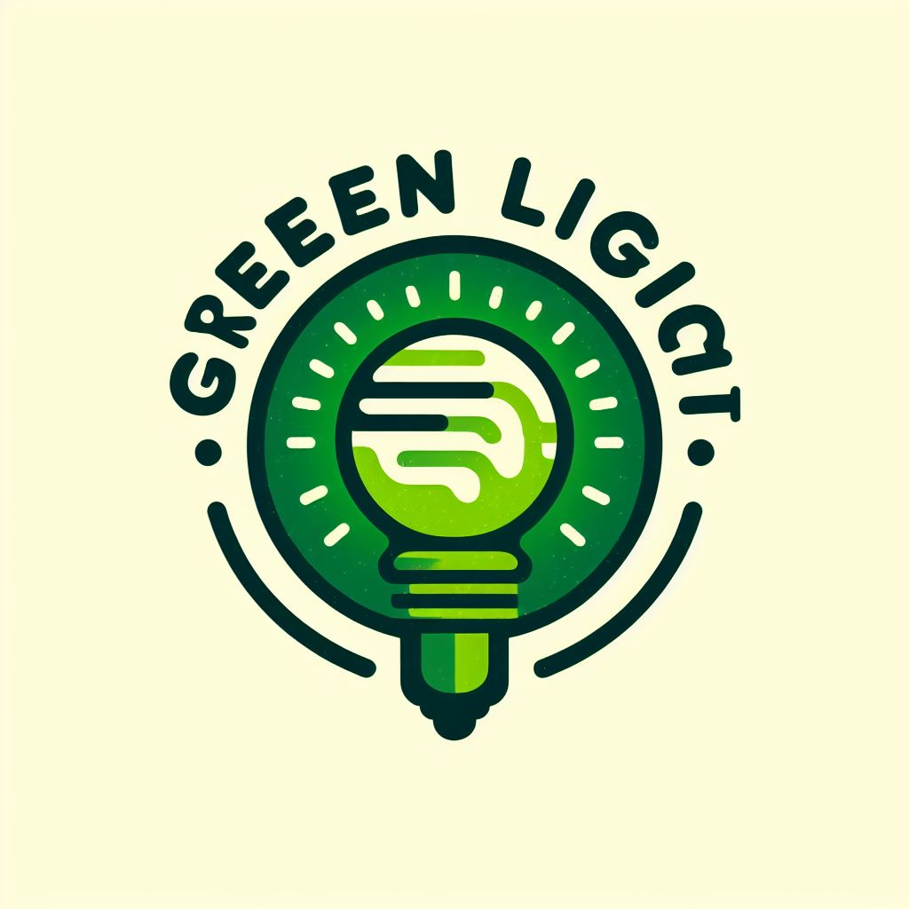

# Glossary

## Contents
+ [Termins for Frontend Development ENG](#termins-front-end) 

 
 
 

<a id="termins-front-end"><h2>Termins for Frontend Dev</h2></a>

### User Experience (UX)
Пользовательский интерфейс (UI) - это совокупное восприятие и взаимодействие пользователя с продуктом, услугой или системой. Она охватывает все аспекты пользовательского взаимодействия, включая внешний вид, удобство использования, процессы взаимодействия и эмоциональный опыт. Главная цель UX - обеспечить пользователю приятное и эффективное взаимодействие с продуктом, что ведет к удовлетворенности и лояльности пользователей.

### User Interface (UI)
Пользовательский опыт (UX) - это часть продукта, которую видит и с которой взаимодействует пользователь. Это включает в себя элементы дизайна, такие как кнопки, поля ввода, макеты и графика, а также способы навигации и взаимодействия. UI-дизайн направлен на создание интуитивно понятного и удобного интерфейса, который обеспечивает пользователю легкий доступ к функционалу продукта и помогает ему достичь своих целей.   

 
 
 

